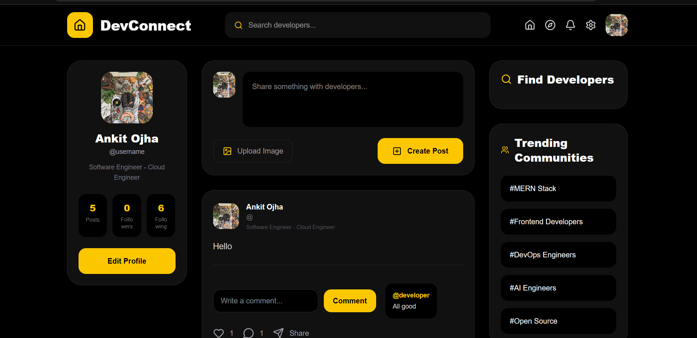
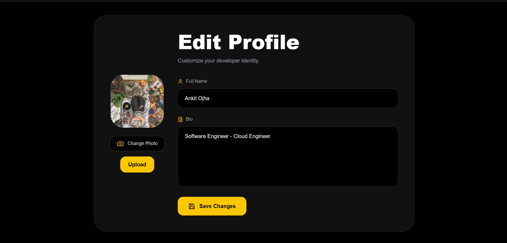
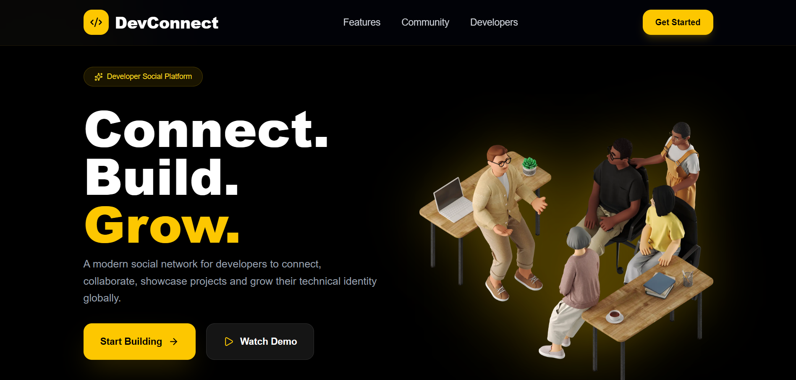
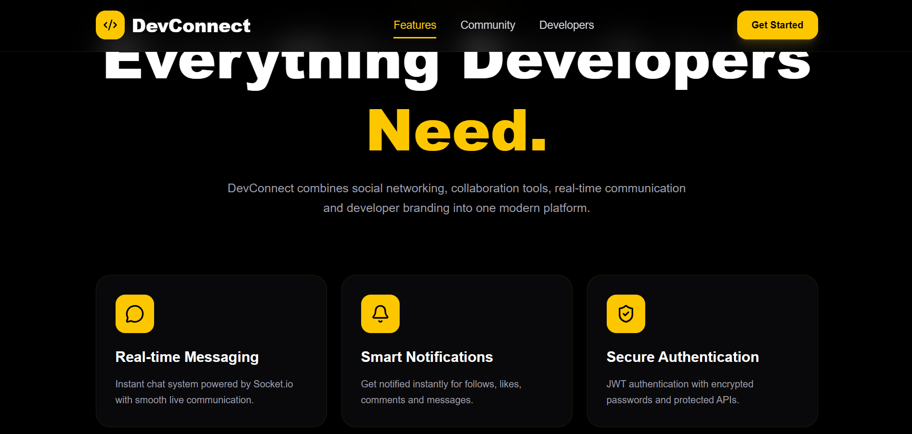
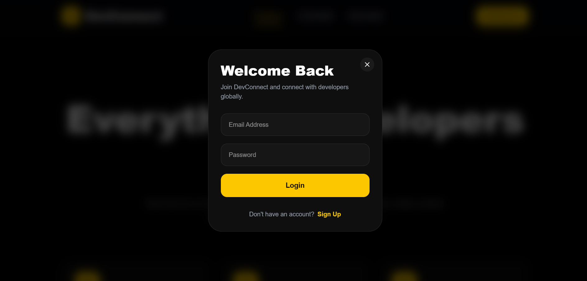

# 🚀 DevConnect Live

A modern full-stack developer social media platform where developers can connect, share posts, follow each other, and communicate in real-time.

DevConnect Live is built using **Next.js**, **TypeScript**, **Node.js**, **Express**, **MongoDB**, and **Socket.io** with a clean and scalable architecture.

---

# ✨ Features

## 🔐 Authentication System
- User Signup & Login
- JWT Authentication
- Protected Routes
- Secure Password Hashing

## 📝 Posts System
- Create Posts
- Delete Posts
- Like & Unlike Posts
- Comment System
- Dynamic Feed

## 👥 Social Features
- Follow / Unfollow Users
- Followers List
- Following List
- User Profiles

## 💬 Real-time Chat
- Real-time Messaging
- Socket.io Integration
- Live User Communication

## 🎨 Modern UI
- Responsive Design
- Dark Theme
- Smooth User Experience
- Optimized Layout

---

# 🛠️ Tech Stack

## Frontend
- Next.js 15
- Motion Frame
- TypeScript
- Tailwind CSS
- Zustand
- Axios

## Backend
- Node.js
- Express.js
- TypeScript
- MongoDB Atlas
- Mongoose
- JWT
- Socket.io

---

# 📂 Project Structure

---

# 🖥️ Client Structure

```bash
client/
│
├── src/
│   ├── app/
│   │   ├── feed/
│   │   ├── profile/
│   │   ├── hooks/
│   │   ├── lib/
│   │   ├── providers/
│   │   ├── services/
│   │   ├── store/
│   │   ├── types/
│   │   ├── favicon.ico
│   │   ├── globals.css
│   │   ├── layout.tsx
│   │   └── page.tsx
│
├── .env.local
├── eslint.config.mjs
├── next.config.ts
├── package.json
├── postcss.config.mjs
├── tsconfig.json
└── README.md
```

---

# ⚙️ Server Structure

```bash
server/
│
├── dist/
├── node_modules/
│
├── src/
│   ├── config/
│   ├── controllers/
│   ├── middleware/
│   ├── models/
│   ├── routes/
│   ├── types/
│   ├── app.ts
│   ├── server.ts
│   └── socket.ts
│
├── .env
├── package.json
├── tsconfig.json
└── README.md
```

---

# ⚡ Installation & Setup

## 1️⃣ Clone Repository

```bash
git clone https://github.com/your-username/devconnect-live.git
```

---

# 📦 Client Setup

## Go to Client Folder

```bash
cd client
```

## Install Dependencies

```bash
npm install
```

## Create `.env.local`

```env
NEXT_PUBLIC_API_URL=http://localhost:5000
```

## Run Client

```bash
npm run dev
```

Client runs on:

```bash
http://localhost:3000
```

---

# 🔥 Server Setup

## Go to Server Folder

```bash
cd server
```

## Install Dependencies

```bash
npm install
```

## Create `.env`

```env
PORT=5000

MONGO_URI=your_mongodb_connection_string

JWT_SECRET=your_secret_key

CLIENT_URL=http://localhost:3000
```

## Run Backend

```bash
npm run dev
```

Server runs on:

```bash
http://localhost:5000
```

---

# 🔌 Socket.io Features

- Real-time messaging
- Online users
- Instant updates
- Live communication system

---

# 📸 Screenshots

## 🏠 Feed Page

```md

```

## 👤 User Profile

```md

```

## 💬 Chat Section

```md

```

## 👥 Following List

```md

```

## ❤️ Posts & Interactions

```md

```

---

# 📡 API Endpoints

# 🔐 Authentication

```bash
POST   /api/auth/register
POST   /api/auth/login
GET    /api/auth/profile
```

---

# 📝 Posts

```bash
GET    /api/posts
POST   /api/posts/create
DELETE /api/posts/:id
PUT    /api/posts/like/:id
POST   /api/posts/comment/:id
```

---

# 👥 Follow System

```bash
PUT    /api/users/follow/:id
PUT    /api/users/unfollow/:id
GET    /api/users/followers/:id
GET    /api/users/following/:id
```

---

# 💬 Messaging

```bash
GET    /api/messages/:conversationId
POST   /api/messages
```

---

# 🚀 Future Improvements

- ✅ Notifications System
- ✅ Story Feature
- ✅ Video Calling
- ✅ AI Chat Assistant
- ✅ GitHub Integration
- ✅ Docker Deployment
- ✅ AWS Deployment
- ✅ Media Uploads
- ✅ Reels System

---

# 🧠 Learning Outcomes

This project helped in understanding:

- Full-stack Architecture
- Authentication Flow
- REST APIs
- Real-time Communication
- State Management
- TypeScript Integration
- Scalable Folder Structure
- Socket.io Implementation

---

# 👨‍💻 Author

# Ankit Kumar Ojha

### MERN Stack Developer | Full Stack Developer

- Frontend Developer
- Backend Developer
- API Specialist
- UI/UX Enthusiast

---

# 🌟 Support

If you like this project, give it a ⭐ on GitHub and share it with others.

---

# 📜 License

This project is licensed under the MIT License.

---

# 🔗 Connect With Me

## GitHub

```md
https://github.com/ankitojha02
```

## LinkedIn

```md
https://www.linkedin.com/in/ankit-ojha-763387360/
```

---